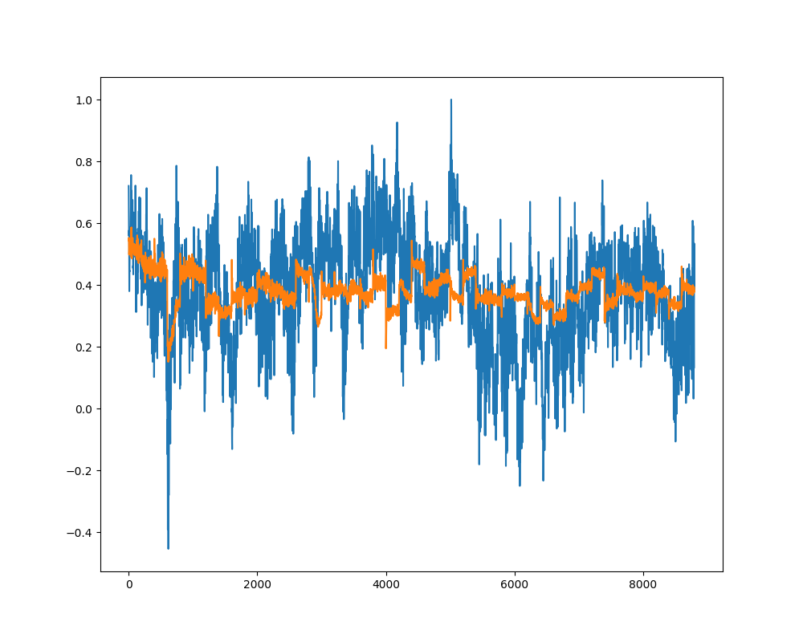

# VAE_Strain (time series forcasting)

## 1. Model 변경 (Transfomer Encoder)

    - 기존의 LSTM을 활용해 time series forcasting을 Transformer Encoder으로 예측
    
    - 기대 효과는 Transformer에 있는 self-attention의 장점을 이용해 예측의 향상 

## 2. 결과
    
    - 전체적인 경향성은 각 parameter별로 따라가는 것으로 확인은 되었지만, 예측된 값은 아직 큰 차이가 있는 것으로 확인

    - 사용한 Data file은 01000002.txt이며, 진행된 결과는 figure_save에 저장된 이미지와 같다 (추가 예정). [e: epoch, p: n_past, b: batch_size]

    
## 3. More..

    - 아직 train을 진행하는 과정에 있으며, 전체 파일에 대한 결과 확인이 필요 (data import 시키는 코드 작업 진행중...)

    - argparse를 이용한 parameter들이 수정이 가능하도록 코드 수정 예정 (2021.11.01 기준)

