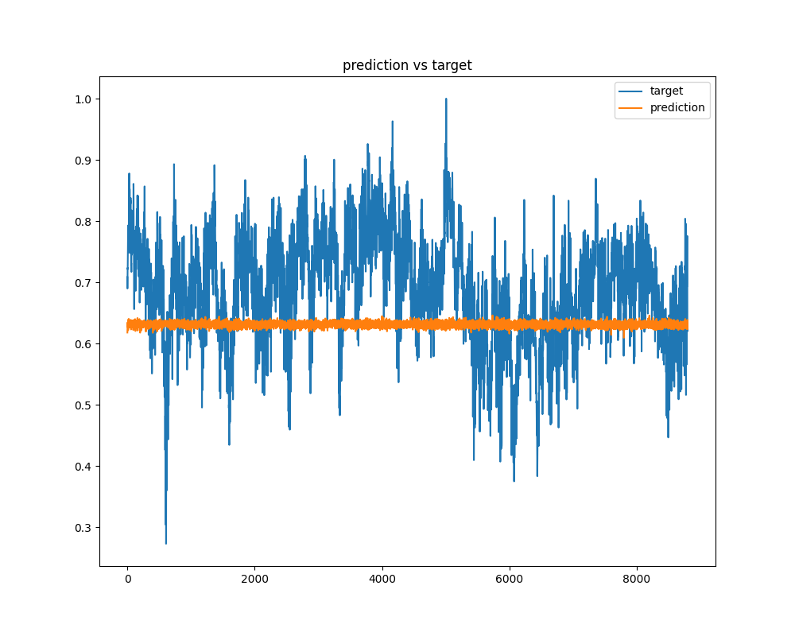

# VAE_Strain (time series forcasting)

## 1-1. Model 변경 (Transfomer Encoder)

    - 기존의 LSTM을 활용해 time series forcasting을 Transformer Encoder으로 예측
    
    - 기대 효과는 Transformer에 있는 self-attention의 장점을 이용해 예측의 향상

## 1-2. VAE 적용 (Transfomer_Encoder_VAE)

    - 극단값을 더 잘 잡아낼 수 있는 효과를 기대

    - Optimizer는 Adam을 이용

    

## 1-3. Model 변경
    
    - 논문의 model을 구현을 위해 Encoder(TransformerEncoder + VAE) => z => Generator (TransformerEncoder) 식으로 modeling 진행

    - Encoder를 통해서 z에 mapping을 시키는 역할 기대, 그리고 Generator 도입하여 z를 input으로 하여서 output으로 예측값을 생성

## 2. 결과
    
### 2.1 Model (Transfomer Encoder) 적용
    - 전체적인 경향성은 각 parameter별로 따라가는 것으로 확인은 되었지만, 예측된 값은 아직 큰 차이가 있는 것으로 확인

    - 과거 값을 이용하는 경우, n_past는 30정도가 제일 양호하게 결과가 나옴 (batch_szie=200, epoch=200 기준)

    - 극단값은 조금씩 잡는듯 하지만, 아직은 모델이 추세를 따라가는 수준으로 성능이 좋지 못한 것으로 보임

    - 결과는 [그림 2.1] 참고

### 2.2 VAE 적용 (Transfomer_Encoder+VAE)
    - VAE loss(MSELoss+KLloss)를 반영하였지만, 예측값이 오히려 더 안나오는 결과가 나옴 (KL loss가 잘 잡히지 않았거나, Transformer Encoder에는 VAE 적용이 조금 어렵다고 생각됨)

    - MSE Loss만 적용 시에는 극단값을 조금 더 잘 잡아내는 수준

    - 결과는 [그림 2.2] 참고

### 2.3 Generator 적용

    - 논문의 내용중 일부였던 Generator 도입해보았지만, 당연하게도 Discriminator 등이 빠졌기에 model의 성능은 앞의 모델들 보다 좋지 못한 결과 발생

    - Discriminator의 적용이나, anomaly score등을 적용하기 위해서는 normal data가 필요한 것으로 판단 (참고한 논문 및 관련 논문들은 train 과정에서 전부 normal data를 이용하고, test 시점에 data에서 anomaly signal을 판단하고 그것을 점수화 하는 방식으로 진행)

    - 결과는 [그림 2.3] 참고

### [그림 2.1] Transformer Encoder 적용

### [그림 2.2] Transformer Encoder + VAE 적용 (loss는 MSELoss로만 적용)

### [그림 2.3] Generator 적용

## 3. More..

    - VAE를 통해서 나온 샘플들이 극단값을 잘 잡아내는지 확인

    - VAE loss(MSELoss+KLloss)를 반영하였지만, 예측값이 오히려 더 안나오는 결과가 나옴 (KL loss가 잘 잡히지 않았거나, Transformer Encoder에는 VAE 적용이 조금 어렵다고 생각됨)

    - MSE Loss만 적용 시에는 극단값을 조금 더 잘 잡아내는 수준

    - 논문의 idea 적용을 위해서는 normal data의 분류 (기준 정의 필요) 또는 수집이 필요한 것으로 보임

